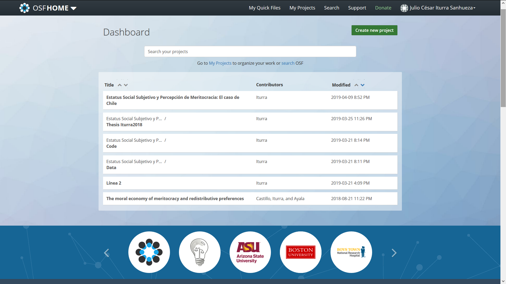
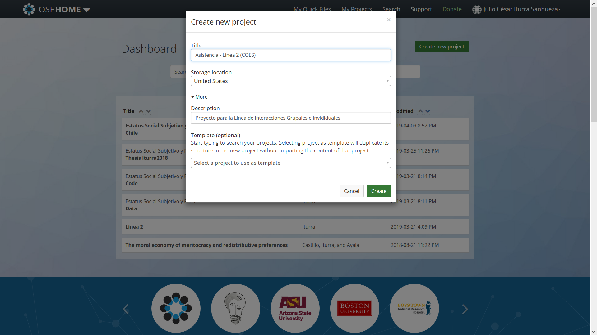
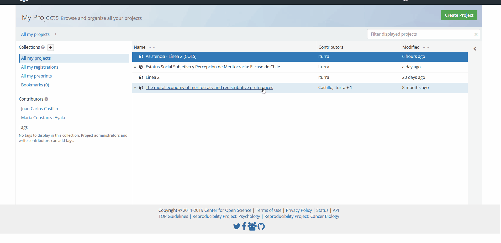

<html>
<head>
  <meta name="viewport" content="width=device-width, initial-scale=1">
  <link rel="stylesheet" href="https://maxcdn.bootstrapcdn.com/bootstrap/3.4.0/css/bootstrap.min.css">
  
  
</head>
<body>

# Documento de Trabajo: Ciencia Abierta

**Julio César Iturra Sanhueza** [^1]

**Juan Carlos Castillo** [^2]

[^1]: Asistente de la Línea de Interacciones Grupales e individuales en **[COES](https://www.coes.cl/)**
[^2]: Subdirector e Investigador Principal en **[COES](https://www.coes.cl/)**

---

### Introducción    

El presente documento tiene por objetivo realizar una introducción conceptual a los principios y prácticas de un modo de trabajo basado en Ciencia Abierta, lo cual a su vez busca ser un aporte para las y los investigadores de la Línea de Interacciones Grupales e Individuales del **[Centro de Conflicto y Cohesión Social](https://www.coes.cl/)**.

La primera sección abordará los principios que orientan una práctica científica basada en la Ciencia Abierta, así también, las prácticas asociadas a una comunidad científica con miras a la producción de conocimiento que cumple con los principios de *Reproducibilidad*, *Apertura* y *Transparencia*. La segunda sección busca introducir al marco de trabajo que ofrece el _**Open Science Framework**_. Comunidad que ha facilitado el acceso libre y transparente a la investigación científica ya realizada, en curso o que su diseño se encuentra en elaboración.

###  *Reproducibilidad, Apertura y Transparencia*   

 {height=9em }

En el contexto de un trabajo colaborativo como parte del quehacer científico, podemos encontrar ejes orientadores o "principios" que dan forma a la manera en que es posible realizar investigación. Siguiendo a  @Nosek2015, una práctica científica basada en la Ciencia Abierta se orienta en base a tres dimensiones o pilares fundamentales. Éstos son Reproducibilidad, Apertura y Transparencia.

#### Reproducibilidad  

Cuando nos referimos a la idea de **Reproducibilidad** (*Reproducibility*), estamos hablando de cómo se vuelve factible que la evidencia producida pueda ser replicada por otros/as investigadores de la comunidad científica. En este sentido, el carácter reproducible de la investigación científica guarda relación con las distintas etapas a través de las cuales debe transitar el trabajo de las y los investigadores.

Conforme a lo anterior, el carácter reproducible del trabajo científico requiere que las etapas de diseño, ejecución, análisis y reporte de resultados tengan presente que cada uno de estos procedimientos deben estar en conocimiento de otros/as miembros de la comunidad científica para garantizar la reproducibilidad de la investigación. De esta manera, se estaría cumpliendo con los estándares mínimos que se requieren para llevar adelante una agenda orientada a que los resultados de la investigación sean reproducibles. No obstante, para cumplir con lo mencionado, se requiere que la comunidad científica tenga acceso a la información, y es desde ahí donde la **Apertura** juega un rol fundamental.   

#### Apertura

¿Podemos garantizar reproducibilidad cuando existen restricciones con respecto a las distintas etapas de la investigación? La respuesta a esta pregunta es *no*, y la alternativa para darle una salida es la **Apertura** (*Openness*) de los componentes y productos de la investigación.  @Nosek2015 sostienen que a lo largo del proceso científico,  la apertura juega un rol fundamental en la medida de que sin la existencia de ésta sería imposible evaluar y reproducir los resultados. En una línea similar, @Camerer2018 sugieren que el acceso abierto a los materiales de investigación permite a los miembros de una comunidad científica tomar postura con respecto a la evidencia producida por sus pares.   

 {width=20em}

Teniendo presente las particularidades de cada disciplina, existen puntos en común desde donde es factible llevar a cabo el principio de Apertura, estos son los estándares de **Diseño de Estudio**, **Materiales de trabajo**, **Disponibilidad de datos** y **Análisis** [@Nosek2015].

i. Los estándares de diseño incrementan la transparencia en torno al proceso de investigación y reduce la vaguedad o parcialidad en el reporte del diseño metodológico de un estudio.

ii. Estándares relacionados con los materiales de investigación motiva a los investigadores a proveer todos los elementos involucrados con el diseño metodológico.

iii. Estándares que incentiven a los autores/as a compartir sistemáticamente los datos producidos en el proceso de investigación, lo cual puede realizarse a través de distintas plataformas.  

iv. Compartir la estrategia analítica, lo cual abarca diversas dimensiones del trabajo investigativo según cada disciplina o métodos empleados. No obstante, un buen ejemplo respecto a cómo es factible cumplir con este estándar, es poner a disposición el código empleado para el análisis estadístico a través de plataformas de acceso libre. Esto último será expuesto más en detalle en el apartado final.

#### Transparencia

La Transparencia puede considerarse como un "objetivo transversal" de la Ciencia Abierta. Basado en los cuatro puntos señalados en el apartado anterior, poner a disposición de la comunidad científica todo el proceso investigativo permite obtener mayores grados de confianza en los resultados reportados, y de esta manera discernir entre aquellos que representan un aporte para las discusiones disciplinares y cuáles no.          

<caption>**Tabla 1**: Estándares para la Ciencia abierta </caption>
|     Open Science Standards                  |
|---------------------------------------------|
| 1. Citations Standards                      |
| 2. Data Transparency                        |
| 3. Analytic methods (code) transparency     |
| 3. Research materials transparency          |
| 4. Design and analysis transparency         |
| 5. Preregistration of studies               |
| 6. Preregistration of analysis plans        |
| 7. Replication                              |
| *Fuente*: @Nosek2015                        |

En el diseño de proyectos de investigación en el marco de trabajo de la Ciencia Abierta, existen medidas como apunta a la reducción de sesgos sistemáticos u omisión de resultados considerados "poco relevantes" por los/as investigadores, tales como el **pre-registro del plan de análisis** [@Nosek2015; @Camerer2018].

@Nosek2018 sostienen que la utilidad de una práctica como el pre-registro del plan de análisis, ya sea de estudios observacionales u experimentales, permite distinguir entre la investigación exploratoria o "generadora de hipótesis" y la investigación confirmatoria o de "prueba de hipótesis". En este sentido, motivar una práctica como es el pre-registro apunta a mejorar los estándares en términos de transparencia y credibilidad de la evidencia resultante de la investigación. El fin último de la transparencia es crear un marco de trabajo con mayor fluidez de la información, de modo tal que    

Un esfuerzo por modificar las prácticas de las y los investigadores, tiene como objetivo generar un vuelco en cómo se hace ciencia, cuestionar los incentivos que motivan a la comunidad científica a mostrar resultados estadísticamente significativos, en desmedro de los resultados "negativos" o que no confirman sus hipótesis o supuestos originales.   

 

#### Ciencias Sociales abiertas

{width=25em}

Estudios como el de @Camerer2018 han demostrado la importancia del pre-registro en las Ciencias Sociales, particularmente en el diseño de experimentos en Psicología y Economía. En sí misma, esta investigación es un buen ejemplo respecto a cómo se puede conducir un estudio con miras a la reproducibilidad.

La Figura 4 muestra cómo es posible emplear plataformas integradas como el [*Open Science Framework*](https://osf.io/) que permiten poner a disposición el plan de análisis, rutinas de código y bases de datos. Si bien el trabajo de @Camerer2018 está orientado a la reproducibilidad de estudios experimentales, los mismos estándares pueden ser empleados en estudios cuantitativos de corte transversal o longitudinal. Para el último caso, el acceso abierto a las rutinas de código de análisis estadístico, y a las bases de datos, representan un estándar mínimo pueden seguir estudios de estas características.

### Características del segundo periodo del Centro

Para el segundo periodo del Centro, se ha puesto como objetivo el desarrollar e impulsar una agenda basada en los principio del la Ciencia Abierta, desde donde se anime a las o los investigadores del Centro a implementar nuevas prácticas relacionadas con la reproducibilidad, apertura y transparencia de los resultados de su trabajo científico.         

Dentro de las cinco tareas para el nuevo periodo de COES, promover una agenda de Ciencia Abierta tiene la potencialidad de contribuir al fortalecimiento de las Redes de Colaboración y establecer un diálogo más fluido con investigadores/as de otras instituciones académicas del contexto nacional e internacional.

@. Fortalecer la Investigación Interdisciplinaria
@. Análisis del Cambio Social.
@. **Ciencia Abierta.**
@. Investigación Aplicada.
@. Redes de Colaboración.

Las implementación de una agenda de estas características contribuirá de manera transversal a los objetivos de Centro, además de poner las herramientas a disposición de otras entidades académicas que manifiesten interés en desarrollar políticas institucionales basadas en los principios de la Ciencia Abierta.        

#### Propuesta de Trabajo

En consonancia con el apartado anterior, este documento de busca contribuir a una agenda basada en los principio de la Ciencia Abierta para el Centro de Estudios de Conflicto y Cohesión Social. A continuación se presentarán una propuesta de trabajo basada en el entorno de colaboración académica que ofrece el [*Open Science Framework*](https://osf.io/).    

El _**Open Science Framework**_ (en adelante OSF) es una plataforma de gestión de proyectos gratuito y abierto que facilita la colaboración a las y los investigadores a lo largo de todo el ciclo de investigación.

   {width=25em}

Como herramienta de colaboración, el OSF permite crear un flujo de trabajo para un grupo de investigación que decide los niveles de privacidad y apertura posee su proyecto. En este marco, las características más relevantes del OSF son:

* **Estructura de proyectos:** Gestión centralizada de archivos, datos, código e información relevante para el proyecto.
* **Acceso Controlado:** Manejo con respecto a qué partes del proyecto son públicas o privadas, lo que facilita colaborar y compartir con el equipo de trabajo o Comunidad científica en general.     
* **Flujo de trabajo eficiente:** Control de versiones automatizado, identificadores para proyectos y materiales, pre-registro de estudios, generador de **pre-prints** (ver [SocArxiv](#socarvix)) e integración con otras plataformas de gestión de datos e información.

* **Repositorio confiable:** Los fondos de preservación del OSF garantizan un acceso libre que se estima en unos 50 años aproximadamente.

  {width=20em}

>
**[SocArxiv](https://osf.io/preprints/socarxiv){#socarvix}** es un servidor de preimpresión (pre-prints) de acceso abierto para las ciencias sociales. Los artículos pueden ser enviados de forma gratuita; Todos los artículos publicados pueden ser descargados gratuitamente. Las discipinas asociadas son **Antropología, Arqueología, Economía, Lingüística, Ciencias políticas, Estudios religiosos, Sociología**

 
 

### Gestión de un proyecto en Open Science Framework

Este apartado está destinado a ilustrar las potencialidades del OSF como repositorio para un proyecto de Tesis de Magister. Se ha elegido un proyecto de autoría propia para efectos del repositorio de ejemplo.

<button type="button" class="btn btn-info" data-toggle="collapse" data-target="#tesis"> Ejemplo  </button>

{width=150%}

> Iturra, J. C. (2019, April 9). Estatus Social Subjetivo y Percepción de Meritocracia: El caso de Chile. Retrieved from osf.io/xn6mh

#### Generar de un Repositorio

<button type="button" class="btn btn-info" data-toggle="collapse" data-target="#uno"> Dashboard </button>

{width=150%}

 

<button type="button" class="btn btn-info" data-toggle="collapse" data-target="#dos"> Crear proyecto </button>

{width=150%}

[Ver aquí](https://osf.io/faszq/)

#### Secciones de un proyecto

1. **Wiki**
2. **Files**
3. **Citations**
4. **Components**
5. **Tags**

### Sitio Web

- Sitio Web en [Github](https://jciturras.github.io/opscoes.github.io/) del proyecto.

### Productividad académica

> [ORCID](https://orcid.org/)

#### Referencias
